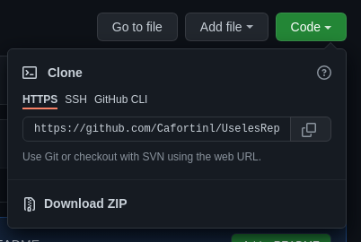
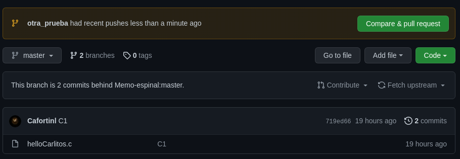
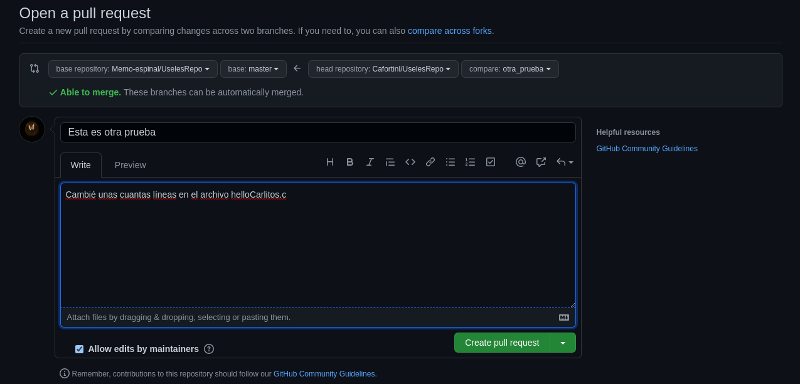

# Introducción a Git
## Presentado por la asociación Kyberia

## Índice
 - Información general
	- ¿Qué es git y para qué sirve?
	- ¿Qué es github y para qué sirve?
- Comandos básicos de git
	- git init
	- git add
	- git status
	- git commit
	- git push
	- git remote
	- git pull
	- git clone
- Introducción a branching
	- git branch
	- git checkout
	- git merge
- Introducción a forking en GitHub
- Fuentes

# Información general

## ¿Qué es git y para qué sirve?
Git es una herramienta de control de versiones diseñado por Linus Torvalds. Su propósito es llevar registro de los cambios en archivos de un proyecto, incluyendo el coordinar trabajo de varias personas en archivos compartidos en un repositorio. Busca hacer todo esto con eficiencia, confiabilidad y compatibilidad del mantenimiento de versiones de aplicaciones cuando tienen un gran número de archivos de código fuente.

## ¿Qué es GitHub y para qué sirve?
GitHub es una plataforma de gestión y organización de proyectos basada en la nube que incorpora las funciones de control de versiones de Git. En la actualidad aloja más de 100 millones de repositorios, la mayoría de los cuales son proyectos de código abierto.

# Comandos básicos de git

## git init
Para poder empezar a utilizar git en un proyecto se utiliza el comando git init.

```bash
$ git init
```

Esto crea un subdirectorio en el directorio del proyecto llamado `.git` que contiene los archivos del repositorio necesarios.

## git add
Para poder agregar archivos para ser rastreados por git se utiliza el comando git add.

Si se desea agregar el archivo `hello.c` el comando sería:

```bash
$ git add hello.c
```

Si se desea agregar todos los archivos que estan en el directorio el comando sería:

```bash
$ git add .
```

o

```bash
$ git add -A
```

Si se desea ignorar algún archivo se debe agregar a un archivo llamado `.gitignore`. Todos los archivos o directorios cuyo nombre esté escrito en este archivo será ignorado por git.

## git status
Si se desea ver el estado de los archivos que git está rastreando se utiliza el comando git status:

```bash
$ git status
```

## git commit
Una vez que ya se agregaron los cambios deseados para poder hacer un comit se utiliza el comando git commit:

```bash
$ git commit -m "comentario"
```

Una recomendación es que el comentario que se ponga en el commit sea algo significativo, lo cual ayude a comprender qué fue lo que se agregó en ese momento.

## git push
Para poder subir el o los últimos commits al repositorio se utiliza el comando git push:

```bash
$ git push
```

En caso de que sea el primer commit puede que sea necesario usar

```bash
$ git push -u origin master
```

## git remote
Para poder usar un repositorio en internet se usa el comando git remote:

```bash
$ git remote add origin url_del_repositorio
```

Esto le dice a git que los commits que se hagan serán replicados en el repositorio que está almacenado en `url_del_repositorio`.
## git pull
Para obtener la versión actualizada del proyecto en la rama principal se usa el comando git pull:

```bash
$ git pull
```
## git clone
Para poder copiar un repositorio existente se usa el comando git clone:

```bash
$ git clone url_del_repositorio
```
# Introducción a branching
Si uno quiere trabajar en alguna nueva opción de un proyecto o arreglar un error en el mismo y no se desea afectar la rama principal hasta que esté completo en lo que se trabajará se puede hacer branching. Cuando se hace branching uno crea una rama paralela a la rama principal, en la que uno puede trabajar y al completar las cosas combinar ambas ramas.

El trabajo de branching normalmente consiste en:
1. Crear una nueva rama para poder trabajar sin hacer cambios directos en `master`.
2. Moverse a la rama en la que se trabajará.
3. Hacer el trabajo necesario, haciendo commits y pushs.
4. Una vez que se termino de trabajar en la rama uno puede regresar a `master` y hacer un merge con la rama en la que se trabajó.
5. Si ya no es necesaria, eliminar la rama en la que se trabajó.

## git branch
El comando git branch sirve para unas cuantas cosas:

```bash
$ git branch
```

El comando que está arriba lista las ramas existentes en el proyecto.

```bash
$ git branch nueva_rama
```

El comando de arriba crea una nueva rama en el proyecto llamada `nueva_rama`.

```bash
$ git branch -d otra_rama
```

Con el comando de arriba se elimina la rama llamada `otra_rama`.

## git checkout
Si uno desea cambiarse de rama uno utiliza el comando git checkout:

```bash
$ git checkout nombre_de_la_rama
```

Uno también puede moverse a una rama nueva:

```bash
$ git checkout -b nueva_rama
```

El comando de arriba es lo mismo a que se haga:

```bash
$ git branch nueva_rama
$ git checkout nueva_rama
```
## git merge
Una vez que uno ya está listo para incluir los cambios que uno hizo en una rama a otra uno utiliza el comando git merge:

```bash
$ git checkout master
$ git merge nueva_rama
```

En el comando anterior lo que se hizo fue regresar a la rama principal `master` e incluir los cambios que se hicieron en `nueva_rama`.

# Introducción a forking en GitHub
Si en algún momento usted quisiera contribuir a un proyecto de código abierto en GitHub uno debe hacer un fork del proyecto. Esto es crear una copia de proyecto en su perfil, en el cual puede trabajar y después hacer un pull request para que el dueño del proyecto original revise los cambios que usted ha hecho y ver si los une al proyecto principal.

Los pasos para esto son:

## Configurar una copia en su computadora
Cuando usted está en la página del proyecto al que desea contribuir debe presionar el botón que dice "fork". Esto creara una copia del repositorio en su perfíl de GitHub. Una vez que esté creada esta copia usted va a esa copia y utiliza git clone para tener una copia en su computadora.




```bash
$ git clone url_de_la_copia_del_repositorio_en_su_perfil
Cloning into 'nombre_del_proyecto'...
...
$ cd nombre_del_proyecto
```

Una vez dentro del directorio del proyecto se debe configurar un remoto que apunte hacia el proyecto original para que uno pueda sincronizar los ultimos cambios a la copia local. Para eso uno necesita el url del proyecto original, el cual lo pueden encontrar bajo el nombre de la copia que está en su perfil.

```bash
$ git remote add upstream url_del_proyecto_original
```

Esto significa que el proyecto tiene dos repositorios remotos:
1. `orirgin` que apunta al fork que usted creo del proyecto al cual usted puede escribir y leer.
2. `upstream` que apunta al repositorio del proyecto original, del cual sólo podemos leer.

## Trabajar en los cambios deseados
Es en este punto en el que usted puede hacer la contribución que deseaba hacer, como por ejemplo arreglar un error. Muchos proyectos tienen un archivo `README` o `INSTALL` para saber cómo hacer que su copia del proyecto funcione. También es posible que el proyecto tenga un archivo en el que expliquen algunas reglas para poder contribuir.

Una vez que el proyecto ya funciona en su máquina ya puede empezar a trabajar en el. Para evitar problemas lo mejor es trabajar con branches. Como ejemplo en el `README` del proyecto que usted va a contribuir dice que las ramas deben tener el formato de `"error/nombre_del_error_a_reparar"` si lo que usted va a hacer es reparar un error.

```bash
$ git checkout master
$ git pull upstream master && git push origin master
$ git checkout -b error/actualizacion_del_readme
```

Aquí uno se asegura de estar en la rama master y después se hace un pull a upstream para sincronizar la copia local al proyecto principal y se hace un push a origin para sincronizar esos cambios a su copia del proyecto. Por último usted crea la rama en la que trabajará y se mueve a ella.

## Crear el pull request
Una vez que completó el trabajo que buscaba hacer debe hacer un push de la rama en la que trabajó a `origin` su copia del proyecto en GitHub.

```bash
$ git push -u origin error/actualizacion_del_readme
```

Esto creará una nueva rama en su proyecto en GitHub.

Una vez que hizo el push debe ir a la página de su copia del proyecto en GitHub y va a ver que en la parte superior de la página estará la rama que usted creó con la opción de "Comparar y pull request". Presione ese botón.



Cuando lo presione lo llevará a una página en la que le puede poner nombre a su pull request y un comentario. Antes de presionar el botón de crear pull request asegurese que en la parte dónde dice "base repository" y "base" estén el proyecto al que usted está contribuyendo y la rama correcta y que dónde dice "head repository" y "compare" estén su copia y la rama que creó.



Una vez hecho esto ya sólo falta que los administradores del proyecto original acepten o no su pull request. Es posible que le pidan que arregle algún merge conflict o algo así para poder aceptarla en caso de que haya un error.

# Fuentes
- https://www.hostinger.es/tutoriales/que-es-github
- https://akrabat.com/the-beginners-guide-to-contributing-to-a-github-project/
